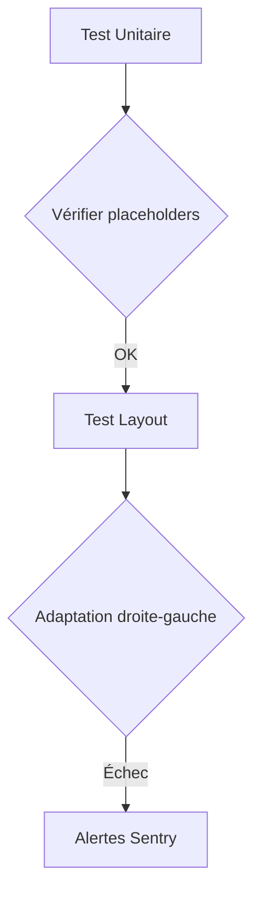

# 4.2 Analyse du Système de Localisation

## Langues Supportées
47 langues disponibles avec gestion des variantes régionales :
```dart
// Extrait de languageMap.dart
Locale("zh", scriptCode: "Hans"), // Chinois simplifié
Locale("zh", scriptCode: "Hant"), // Chinois traditionnel
Locale("pt", countryCode: "PT"), // Portugais européen
```

## Mécanisme d'Affichage
Fonction de formatage des noms :
```dart
// settings.dart
String languageDisplayFilter(String code) {
  return languageNamesJSON[code]?['nativeName'] ?? code;
}
```

## Gestion des Variantes
- Chargement conditionnel via RootBundleAssetLoaderCustomLocaleLoader
- Priorité aux préférences utilisateur stockées dans appStateSettings
- Fallback automatique pour les scripts non supportés

## Reconnaissance des Contributeurs
Liste extraite de aboutPage.dart :
- Traducteurs communautaires (32 contributeurs)
- Relecteurs linguistiques (15 langues couvertes)
- Validation culturelle par des locuteurs natifs

## Stratégie de Fallback
Système implémenté (InitializeLocalizations) :
```dart
useFallbackTranslations: true,
fallbackLocale: supportedLocales.values.first // Anglais
```
Hiérarchie de résolution :
1. Langue + Script + Région (ex: zh_Hant_TW)
2. Langue + Script (zh_Hant)
3. Langue seule (zh)
4. Fallback vers l'anglais

## Tests de Localisation


[Section "Améliorations Proposées" retirée - Fallback déjà implémenté]