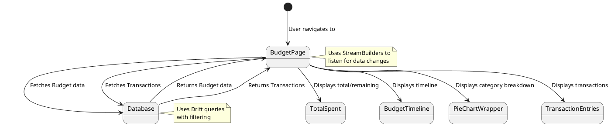

# Technical Implementation Document

## 1. Data Structures

This document provides an overview of the architecture of the Cashew budget tracking application. The application is built using the Flutter framework and utilizes a combination of local storage, Firebase services, and custom UI components.

### 1.1. Budget

The `Budget` entity represents a financial budget with the following attributes:

| Field                       | Data Type                      | Description                                                                                                                                                                                                                            |
| :-------------------------- | :----------------------------- | :------------------------------------------------------------------------------------------------------------------------------------------------------------------------------------------------------------------------------------- |
| `budgetPk`                  | `TextColumn` (UUID)            | Primary key, unique identifier for the budget.                                                                                                                                                                                         |
| `name`                      | `TextColumn` (String)          | Name of the budget (max length: 250 characters).                                                                                                                                                                                      |
| `amount`                    | `RealColumn` (double)          | Budget amount.                                                                                                                                                                                                                         |
| `colour`                    | `TextColumn` (String, nullable) | Color associated with the budget (max length: 50 characters).                                                                                                                                                                         |
| `startDate`                 | `DateTimeColumn`               | Start date of the budget.                                                                                                                                                                                                              |
| `endDate`                   | `DateTimeColumn`               | End date of the budget.                                                                                                                                                                                                                |
| `walletFks`                 | `TextColumn` (List\<String>)    | List of wallet primary keys (UUIDs) associated with this budget. Uses a custom `StringListInColumnConverter` for database storage.                                                                                                    |
| `categoryFks`               | `TextColumn` (List\<String>)    | List of category primary keys (UUIDs) included in this budget. Uses a custom `StringListInColumnConverter` for database storage.                                                                                                    |
| `categoryFksExclude`        | `TextColumn` (List\<String>)    | List of category primary keys (UUIDs) to be excluded from this budget. Uses a custom `StringListInColumnConverter` for database storage.                                                                                             |
| `income`                    | `BoolColumn` (boolean)         | Indicates if the budget is for income (true) or expenses (false). Default is false.                                                                                                                                                  |
| `archived`                  | `BoolColumn` (boolean)         | Indicates if the budget is archived. Default is false.                                                                                                                                                                                |
| `addedTransactionsOnly`     | `BoolColumn` (boolean)         | Indicates if only transactions explicitly added to this budget should be considered. Default is false.                                                                                                                               |
| `periodLength`              | `IntColumn` (int)              | Length of the budget period (e.g., number of days, weeks, months, or years).                                                                                                                                                           |
| `reoccurrence`              | `IntColumn` (enum)             | Reoccurrence pattern of the budget (e.g., daily, weekly, monthly, yearly). Uses a custom enum `BudgetReoccurence`.                                                                                                                      |
| `dateCreated`               | `DateTimeColumn`               | Date and time when the budget was created.                                                                                                                                                                                             |
| `dateTimeModified`          | `DateTimeColumn` (nullable)    | Date and time when the budget was last modified.                                                                                                                                                                                       |
| `pinned`                    | `BoolColumn` (boolean)         | Indicates if the budget is pinned to the home screen. Default is false.                                                                                                                                                               |
| `order`                     | `IntColumn` (int)              | Order of the budget in lists.                                                                                                                                                                                                          |
| `walletFk`                  | `TextColumn` (String)          | Foreign key referencing the primary key of the `Wallets` table. Defaults to "0", indicating a general budget not tied to a specific wallet.                                                                                             |
| `budgetTransactionFilters`  | `TextColumn` (List)            | List of filters to apply when selecting transactions for this budget. Uses a custom `BudgetTransactionFiltersListInColumnConverter` for database storage.                                                                             |
| `memberTransactionFilters` | `TextColumn` (List\<String>)    | List of member email addresses to filter transactions by, for shared budgets. Uses a custom `StringListInColumnConverter` for database storage.                                                                                       |
| `sharedKey`                 | `TextColumn` (String, nullable) | Unique key for shared budgets, used for synchronization with Firebase.                                                                                                                                                                |
| `sharedOwnerMember`         | `IntColumn` (enum, nullable)   | Indicates if the user is the owner or a member of a shared budget. Uses a custom enum `SharedOwnerMember`.                                                                                                                             |
| `sharedDateUpdated`         | `DateTimeColumn` (nullable)    | Date and time when the shared budget was last updated.                                                                                                                                                                                  |
| `sharedMembers`             | `TextColumn` (List\<String>, nullable) | List of member email addresses associated with the shared budget. Uses a custom `StringListInColumnConverter` for database storage.                                                                                               |
| `sharedAllMembersEver`      | `TextColumn` (List\<String>, nullable) | List of all member email addresses that have ever been associated with the shared budget. Uses a custom `StringListInColumnConverter` for database storage.                                                                        |
| `isAbsoluteSpendingLimit`   | `BoolColumn` (boolean)         | Indicates if the budget uses an absolute spending limit (true) or a percentage-based limit (false). Default is false.                                                                                                                 |

### 1.2. Transaction

The `Transaction` entity represents a financial transaction with the following attributes:

| Field                           | Data Type                      | Description                                                                                                                                                                                                                |
| :------------------------------ | :----------------------------- | :------------------------------------------------------------------------------------------------------------------------------------------------------------------------------------------------------------------------- |
| `transactionPk`                 | `TextColumn` (UUID)            | Primary key, unique identifier for the transaction.                                                                                                                                                                       |
| `pairedTransactionFk`          | `TextColumn` (String, nullable) | Foreign key referencing another transaction, used for linking related transactions (e.g., transfers between accounts).                                                                                                       |
| `name`                          | `TextColumn` (String)          | Name or title of the transaction (max length: 250 characters).                                                                                                                                                            |
| `amount`                        | `RealColumn` (double)          | Transaction amount.                                                                                                                                                                                                        |
| `note`                          | `TextColumn` (String)          | Note associated with the transaction (max length: 500 characters).                                                                                                                                                         |
| `categoryFk`                   | `TextColumn` (String)          | Foreign key referencing the primary key of the `Categories` table.                                                                                                                                                           |
| `subCategoryFk`                | `TextColumn` (String, nullable) | Foreign key referencing the primary key of the `Categories` table, for subcategories.                                                                                                                                        |
| `walletFk`                      | `TextColumn` (String)          | Foreign key referencing the primary key of the `Wallets` table. Defaults to "0", indicating a general transaction not tied to a specific wallet.                                                                               |
| `dateCreated`                   | `DateTimeColumn`               | Date and time when the transaction was created.                                                                                                                                                                           |
| `dateTimeModified`              | `DateTimeColumn` (nullable)    | Date and time when the transaction was last modified.                                                                                                                                                                     |
| `originalDateDue`               | `DateTimeColumn` (nullable)    | For recurring transactions, stores the original due date.                                                                                                                                                                  |
| `income`                        | `BoolColumn` (boolean)         | Indicates if the transaction is an income (true) or an expense (false). Default is false.                                                                                                                                    |
| `periodLength`                  | `IntColumn` (int, nullable)     | For recurring transactions, the length of the recurring period.                                                                                                                                                              |
| `reoccurrence`                  | `IntColumn` (enum, nullable)   | Recurrence pattern of the transaction (e.g., daily, weekly, monthly, yearly). Uses a custom enum `BudgetReoccurence`.                                                                                                        |
| `endDate`                       | `DateTimeColumn` (nullable)    | For recurring transactions, the end date of the recurrence.                                                                                                                                                                  |
| `upcomingTransactionNotification` | `BoolColumn` (boolean, nullable) | Indicates if a notification should be shown for upcoming transactions. Default is true.                                                                                                                                     |
| `type`                          | `IntColumn` (enum, nullable)   | Special transaction type (e.g., upcoming, subscription, repetitive, credit, debt). Uses a custom enum `TransactionSpecialType`.                                                                                                |
| `paid`                          | `BoolColumn` (boolean)         | Indicates if the transaction is marked as paid. Default is false.                                                                                                                                                            |
| `createdAnotherFutureTransaction` | `BoolColumn` (boolean, nullable) | Indicates if another future transaction has been created for a recurring transaction. Default is false.                                                                                                                     |
| `skipPaid`                      | `BoolColumn` (boolean)         | Indicates if a recurring transaction instance has been skipped. Default is false.                                                                                                                                               |
| `methodAdded`                   | `IntColumn` (enum, nullable)   | Indicates how the transaction was added (e.g., manually, via email, shared). Uses a custom enum `MethodAdded`.                                                                                                                  |
| `transactionOwnerEmail`         | `TextColumn` (String, nullable) | For shared transactions, the email address of the transaction owner.                                                                                                                                                           |
| `transactionOriginalOwnerEmail` | `TextColumn` (String, nullable) | For shared transactions, the email address of the original transaction owner (if different).                                                                                                                                   |
| `sharedKey`                     | `TextColumn` (String, nullable) | Unique key for shared transactions, used for synchronization with Firebase.                                                                                                                                                      |
| `sharedOldKey`                  | `TextColumn` (String, nullable) | Stores the previous `sharedKey` when a transaction is removed from sharing.                                                                                                                                                     |
| `sharedStatus`                  | `IntColumn` (enum, nullable)   | Status of the shared transaction (e.g., waiting, shared, error). Uses a custom enum `SharedStatus`.                                                                                                                               |
| `sharedDateUpdated`             | `DateTimeColumn` (nullable)    | Date and time when the shared transaction was last updated.                                                                                                                                                                      |
| `sharedReferenceBudgetPk`       | `TextColumn` (String, nullable) | Foreign key referencing the primary key of the `Budgets` table, indicating the budget this transaction is shared with.                                                                                                            |
| `objectiveFk`                   | `TextColumn` (String, nullable) | Foreign key referencing the primary key of the `Objectives` table, for transactions associated with goals.                                                                                                                         |
| `objectiveLoanFk`               | `TextColumn` (String, nullable) | Foreign key referencing the primary key of the `Objectives` table, for transactions associated with loans.                                                                                                                         |
| `budgetFksExclude`              | `TextColumn` (List\<String>, nullable) | List of budget primary keys (UUIDs) from which this transaction should be excluded. Uses a custom `StringListInColumnConverter` for database storage.                                                                        |

## 2. Algorithms (Budget Calculation)

Budget calculation logic is distributed across `lib/pages/budgetPage.dart` and database methods in `lib/database/tables.dart`.

1. **Data Retrieval:** `BudgetPage` uses `StreamBuilder` to listen for `Budget` and transaction data. Key database methods:
    - `watchTotalSpentInEachCategoryInTimeRangeFromCategories`: Retrieves transactions within a time range, filtered by categories, wallets, budget filters (income/expense, shared, added to other budgets, etc.), member filters, search query. Groups by category and calculates total spent.
    - `watchTotalOfBudget`: Calculates overall total spent within the budget's time range, using the same filters.

2. **Data Aggregation:** The above methods aggregate transaction amounts.

3. **UI Display:**
    - `TotalSpent` widget: Displays total spent or remaining amount.
    - `BudgetTimeline` widget: Visualizes budget progress.
    - `PieChartWrapper` widget: Shows spending breakdown by category.
    - `TransactionEntries` widget: Lists transactions.

4. **User Interaction:** Users can select categories, toggle subcategories/spending limits, change date ranges, and edit budget details.

### 2.1 Data Flow Diagram

## 3. Technologies Used

- **Language:** Dart
- **Framework:** Flutter
- **State Management:** Provider, Shared Preferences
- **Database:** Drift (SQLite), Cloud Firestore
- **Authentication:** Firebase Auth, Google Sign-In, local_auth
- **Internationalization:** easy_localization, intl
- **UI:** Flutter Material, fl_chart, animations, etc. (see `pubspec.yaml`).
- **Networking:** googleapis, universal_html
- **Utilities:** path_provider, path, math_expressions, share_plus, etc. (see `pubspec.yaml`).

## 4. API Endpoints

- **Local Database (Drift/SQLite):**  `FinanceDatabase` class provides methods for all local data operations.
- **Firebase Cloud Firestore:** Used for authentication and data synchronization (details require further investigation, likely in `syncClient.dart`). No custom REST API.

## 5. Error Handling

- `try`/`catch` blocks in database migrations.
- Input validation (e.g., transaction amounts).

## 6. Performance Considerations

- `StreamBuilder` for reactive UI updates.
- Database queries with filtering/ordering.
- `groupBy` in some database queries.
- Logic to limit past budget periods in calculations.
- `KeepAliveClientMixin` to preserve widget state.

## 7. Security Measures

- Firebase Authentication.
- Local biometric authentication.
- Local database (SQLite) for data storage.

## 8. Design Patterns

- Singleton (database instance).
- Provider (state management).
- Observer (`StreamBuilder`).
- Data Access Object (DAO) - `FinanceDatabase` class.
- TypeConverter (Drift).

This is a concise summary due to tool limitations. Further code investigation would be needed for a more in-depth analysis.
